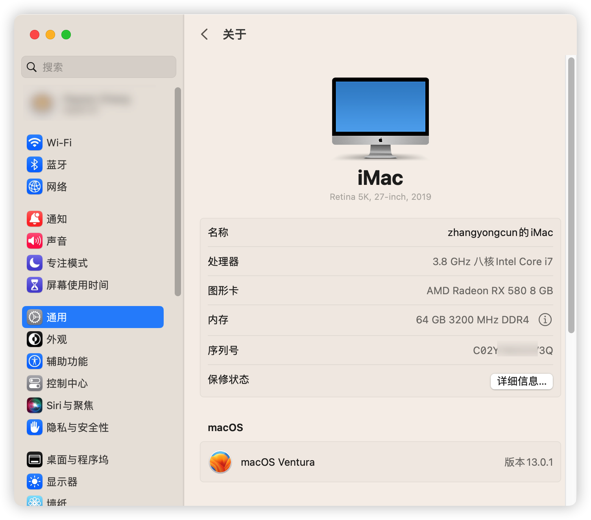

## 配置清单

参考文档：[OpenCore](https://dortania.github.io/OpenCore-Install-Guide/)

CPU：[i7 10700K](https://ark.intel.com/content/www/us/en/ark/products/199335/intel-core-i710700k-processor-16m-cache-up-to-5-10-ghz.html)

主板：[ROG STRIX Z490-A GAMING](https://rog.asus.com/tw/motherboards/rog-strix/rog-strix-z490-a-gaming-model/spec/)

内存： 128G DDR4 

硬盘：[西部数据 SN 750 500G](https://www.westerndigital.com/products/internal-drives/wd-black-sn750-nvme-ssd#WDS500G3XHC)

显卡：  [RX580 8G](https://www.gigabyte.com/tw/Graphics-Card/GV-RX580GAMING-8GD-rev-10-11-12#kf)

无线模块：BCM943602CS

键盘：秒控键盘第三代（A1314） （两节五号电池 🔋）

鼠标：妙控板（两节五号电池 🔋）

显示器：[Redmi 27 显示器](https://www.mi.com/redmi-mon27?product_id=1222200038)

## 功能

- 随航
- 隔空投送
- Apple 解锁 Mac
- AirPlay to Mac
- 通用粘贴板、接力
- 通用控制

