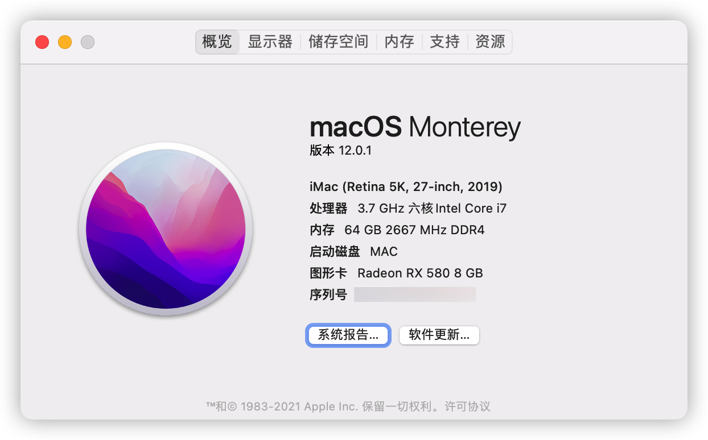

## 配置清单

参考文档：[OpenCore](https://dortania.github.io/OpenCore-Install-Guide/)

CPU：[i7 8700K](https://ark.intel.com/content/www/cn/zh/ark/products/126684/intel-core-i7-8700k-processor-12m-cache-up-to-4-70-ghz.html)

主板：[Z370 Pro4](https://www.asrock.com/mb/Intel/Z370%20Pro4/index.asp)

内存： 64G DDR4 

硬盘：[西部数据 SN 570 1T](https://www.westerndigital.com/products/internal-drives/wd-blue-sn570-nvme-ssd)

显卡：  [RX580 8G](https://www.gigabyte.com/tw/Graphics-Card/GV-RX580GAMING-8GD-rev-10-11-12#kf)

无线模块：BCM943602CS

键盘：秒控键盘 1代

鼠标：罗技蓝牙鼠标 M558

显示器：LG HDR 4K

## 安装步骤

### 设置 BIOS

##### BIOS：

- 【Fast Boot】  **Disabled**
- 【GSM Support】 **Disabled** （推荐关闭，我测试不关闭不影响）

##### Peripherals：

- 【USB Configuration > XHCI Hand-off】  **Enabled**  （重要！！！）

##### Chipset

- VT-d Disabled

## 功能

- 随航
- 隔空投送
- Apple 解锁 Mac
- AirPlay to Mac
- 通用粘贴板、接力
- 通用控制

